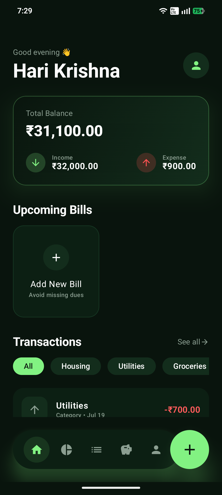
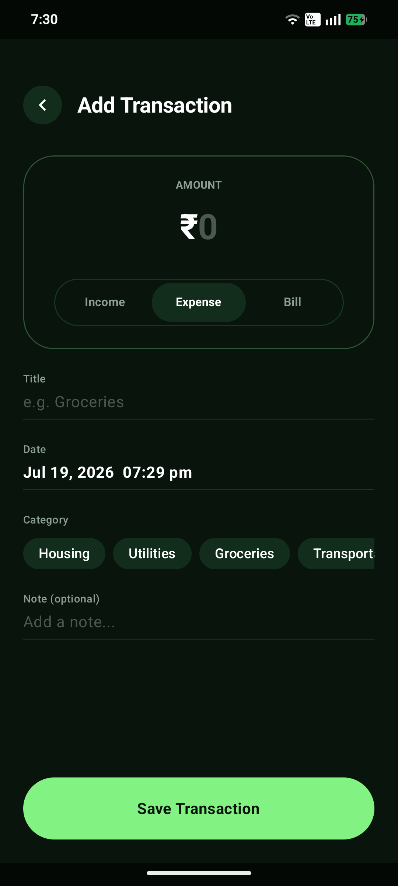
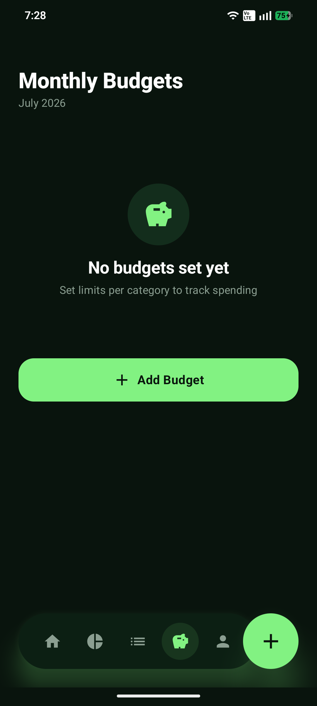

<div align="center">
  
  <h1>💰 RupeeFlow</h1>
  <p><b>Smart Personal Finance Tracker for Android</b></p>
</div>

[](https://android.com)
[](https://kotlinlang.org)
[](https://developer.android.com/jetpack/compose)
[](LICENSE)
[](https://github.com/harikrishnabuilds/Rupeeflow/releases/tag/v1.0.0)
  <a href="https://github.com/harikrishnabuilds/Rupeeflow/releases/download/v2.0/Rupeeflow.v.02.apk">
    
  </a>

**Take control of your money. Track spending, set budgets, get bill alerts — all in one beautiful app.**

[⬇️ Download APK](https://github.com/harikrishnabuilds/Rupeeflow/releases/download/v2.0/Rupeeflow.v.02.apk) [🐛 Report Bug](https://github.com/harkrishnabuilds/Rupeeflow/issues) • [💡 Request Feature](https://github.com/harkrishnabuilds/Rupeeflow/issues)

</div>

---

## ✨ Features

| Feature | Description |
|---|---|
| 💸 **Expense Tracking** | Log income and expenses with categories and notes |
| 📊 **Analytics** | Visual charts showing spending breakdown by category |
| 🎯 **Budget System** | Set monthly budgets per category with 80%/100% alerts |
| 🔔 **Bill Reminders** | Never miss a bill — get alerts 3, 5, or 7 days before due date |
| 🔁 **Recurring Transactions** | Auto-add salary, Netflix, rent — set once and forget |
| 📤 **Export Reports** | Download monthly reports as PDF or CSV |
| 🔒 **Biometric Lock** | Fingerprint / Face ID to secure your financial data |
| 🏠 **Home Screen Widget** | See your balance without opening the app |
| 🔍 **Search & Filter** | Search by title, filter by date, category, or amount |
| 🌙 **Dark Mode** | Follows your system theme automatically |

---

## 📱 Screenshots

<div align="center">
  
  &nbsp;&nbsp;
  
  &nbsp;&nbsp;
  
  &nbsp;&nbsp;
</div>
---

## 🛠️ Tech Stack

- **Language:** Kotlin
- **UI:** Jetpack Compose + Material Design 3
- **Database:** Room (SQLite)
- **State:** ViewModel + StateFlow + Coroutines
- **Storage:** DataStore Preferences
- **Charts:** Vico Charts
- **Images:** Coil
- **Widget:** Glance AppWidget
- **Auth:** AndroidX Biometric

---

## 🚀 Getting Started

### Download & Install
1. Go to [Releases](https://github.com/harkrishnabuilds/Rupeeflow/releases/latest)
2. Download `Rupeeflow.apk`
3. On your Android phone: **Settings → Install unknown apps → Allow**
4. Open the downloaded APK and install

### Build from Source
```bash
git clone https://github.com/harkrishnabuilds/Rupeeflow.git
cd Rupeeflow
# Open in Android Studio and run!
```

**Requirements:**
- Android Studio Hedgehog or newer
- Android SDK 26+
- Kotlin 1.9+

---

## 👤 Author

**M Hari krishna** (harkrishnabuilds)

[](https://linkedin.com/in/iamharikrishna)
[](https://github.com/harikrishnabuilds)

---

## 📄 License

This project is licensed under the MIT License — see the [LICENSE](LICENSE) file for details.

---

<div align="center">
Made with ❤️ in India 🇮🇳
</div>
